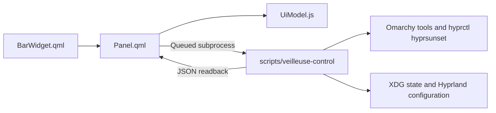

# Veilleuse architecture

Veilleuse is an Omarchy Quattro shell plugin for display brightness, hyprsunset night light, and schedule automation. The QML panel talks to a synchronous, standard-library-only Python helper through bounded subprocess calls. Installation, usage, and the CLI reference live in the [README](README.md) and [CLI.md](CLI.md).

## Components

| Area | Files | Responsibility |
| --- | --- | --- |
| Shell UI | `BarWidget.qml`, `Panel.qml`, `NerdIcon.qml` | Status widget, popout routes, controls, keyboard and pointer navigation |
| UI logic | `UiModel.js`, `I18n.js`, `Icons.js` | State normalization, schedule validation, request ordering, translations, glyphs |
| Backend | `scripts/veilleuse-control` | CLI entry point; calls Omarchy brightness and hyprsunset commands |
| Automation and persistence | `scripts/automation_utils.py`, `scripts/state_utils.py` | Snooze, transitions, reconciliation, private XDG settings/state/history |
| User configuration | `scripts/schedule_utils.py`, `scripts/schedule_toggle_utils.py`, `scripts/shortcut_utils.py` | Schedule parsing and transactions; optional Hyprland binding management |

## Request flow

The panel owns shell IPC and the latest-wins request queue. The helper owns synchronous CLI operations, bounded subprocesses, and diagnostics. It delegates schedule parsing to `schedule_utils.py`, enable/disable transactions to `schedule_toggle_utils.py`, bindings to `shortcut_utils.py`, reconciliation to `automation_utils.py`, and private storage to `state_utils.py`.

## Storage and security

| File path | Purpose | Permissions | Safety mechanism |
| :--- | :--- | :--- | :--- |
| `~/.config/hypr/hyprsunset.conf` | Night light temperature and schedule | Preserves the existing mode; a newly generated file uses `0600` | Atomic write under a shared lock; `.bak` when updating an existing file |
| `~/.config/hypr/.hyprsunset.conf.veilleuse-toggle.pending` | Recovery record for an interrupted schedule enable/disable | `0600` | Written before changing the schedule; resolved under the shared lock on the next schedule operation |
| `~/.config/hypr/bindings.lua` | Optional Hyprland shortcut | Preserves the existing mode; a newly created file uses `0644` | Collision checks and marker-block ownership; one-time `.bak` before install/update |
| `~/.config/veilleuse/config.json` | Backend schema document; currently contains only `schema` | `0600` | Atomic replace, versioned schema, stripped legacy keys |
| `~/.local/state/veilleuse/state.json` | Runtime state, snooze tokens, display values | `0600` | Atomic write, bounded validation |
| `~/.local/state/veilleuse/history.jsonl` | Audit history of operations | `0600` | Ring buffer capped at the last 50 entries |

Paths follow absolute `XDG_CONFIG_HOME` and `XDG_STATE_HOME` values, with the defaults shown above. Private persistence rejects symlink path components and non-regular document files. See the [README configuration guide](README.md#configuration) for panel settings and environment variables.

### Core invariants

1. **Non-destructive parsing** — Custom profiles, comments, and unmanaged blocks in `hyprsunset.conf` are preserved during schedule updates.
2. **Request ordering** — Request IDs increase monotonically. Only the current request ID is accepted as the current response. A stale successful readback may still be merged to reflect a write that completed; a running non-supersedable mutation is allowed to finish before the latest queued request launches.
3. **Fail-closed normalization** — Unavailable readings are marked explicitly and their controls are disabled; independent controls remain usable. Errors map to English and Spanish messages. This does not guarantee that a failed physical write can restore the display.
4. **Zero daemon policy** — The loaded panel starts reconciliation after initialization and every 30 seconds when no request is pending, even when closed. Each helper call exits after completion. Veilleuse automation does not run while its panel/shell is unloaded; `hyprsunset` remains a separate system component.

## Localization

`I18n.js` provides English and Spanish dictionaries with tested key parity. Unknown locales select English. Missing keys fall back to English, then Spanish, then the raw key. `UiModel.js` maps known backend error codes to localized messages; unrecognized diagnostics retain their original text.

## Verification scope

`tests/` contains Python unit tests and Node.js model/contract tests. Layout tests inspect QML source and navigation stress tests run a JavaScript harness; neither suite launches the real Quickshell UI. See [TEST_INFRA.md](TEST_INFRA.md) for coverage limits and [CONTRIBUTING.md](CONTRIBUTING.md) for local verification steps.
