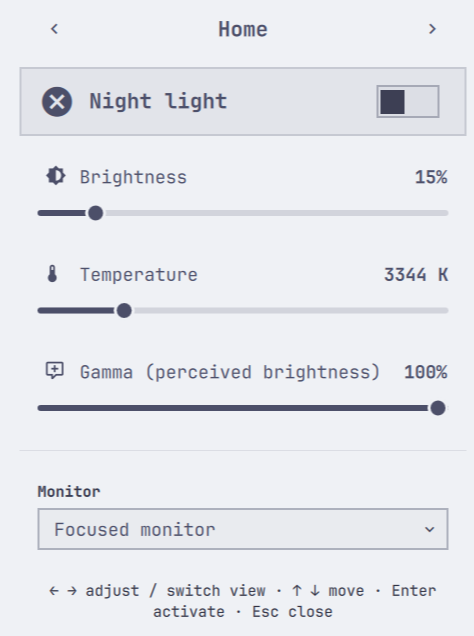
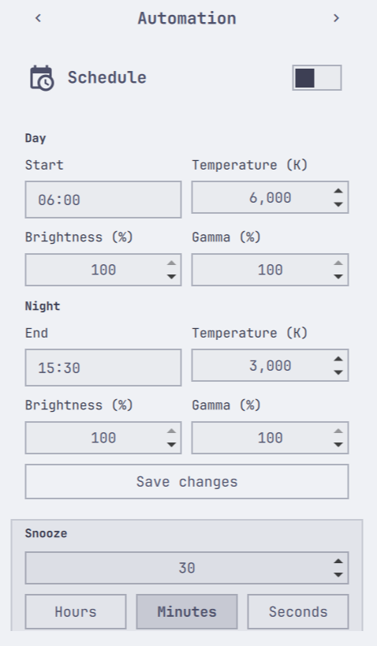
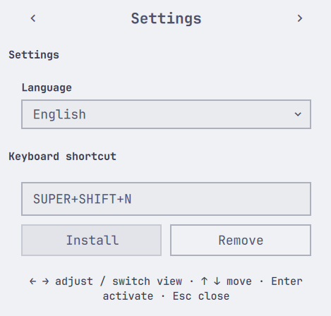

<div align="center">

# Veilleuse

**Native brightness, night light temperature, and day/night automation for Omarchy Quattro.**<br/>
Circadian lighting and display controls powered by Hyprsunset and Quickshell.

[](https://github.com/ZnOw01/Veilleuse/actions/workflows/checks.yml)
[](https://github.com/ZnOw01/Veilleuse/releases)
[](https://github.com/ZnOw01/Veilleuse)
[](https://hyprland.org/)
[](https://www.python.org/)
[](LICENSE)

[Features](#features) ·
[Quick Start](#quick-start) ·
[Screenshots](#screenshots) ·
[Panel & Navigation](#panel--navigation) ·
[CLI Reference](#cli-reference) ·
[Architecture & Storage](#architecture--storage) ·
[Troubleshooting](#troubleshooting) ·
[Development](#development) ·
[License](#license)

</div>

---

## Screenshots

<div align="center">

| Home | Automation | Settings |
| :---: | :---: | :---: |
|  |  |  |
| Night-light toggle, live brightness, temperature and gamma sliders, monitor picker | Day/night schedule editor with per-period display values and timed snooze | Language selector and conflict-checked global shortcut binding |

</div>

---

## Features

| Feature | What you get |
| :--- | :--- |
| **Display Brightness** | Smooth 1–100% brightness control for focused and specific monitors |
| **Night Light & Gamma** | Temperature adjustment (`2500–6500 K`) and gamma correction (`0–100%`) via `hyprsunset` |
| **Day/Night Automation** | Scheduled transitions with per-period brightness, temperature, and gamma values |
| **Timed Snooze** | Temporarily suspend night light (1m–24h) with automatic expiration and state reconciliation |
| **Hybrid Navigation** | Arrow-key navigation (`← → ↑ ↓`) with real-time mouse-hover cursor tracking |
| **Safe Hyprland Shortcuts** | Conflict-checked, reversible shortcut management in `~/.config/hypr/bindings.lua` |
| **Zero External Deps** | 100% Python standard library backend; no background daemons or pip dependencies |
| **Dual Localization** | Full English (`en`) and Spanish (`es`) localization dictionaries with strict key parity |
| **Atomic Persistence** | Mode `0600` XDG configuration and state storage protected by lockfiles and `.bak` backups |

---

## Quick Start

### Requirements

- **Omarchy Quattro** (Omarchy 4.0+)
- **Hyprland** with `hyprsunset` installed
- **Python 3.12+** (`/usr/bin/python3`, standard library only)

### Installation

```bash
omarchy plugin add https://github.com/ZnOw01/Veilleuse.git --enable --yes
```

> [!NOTE]
> Omarchy Shell plugins run in-process and unsandboxed. Veilleuse operates fail-closed, performs atomic writes, and never spawns persistent background daemons.

### Updating

```bash
omarchy plugin update io.github.znow01.veilleuse --yes
omarchy restart shell
```

> [!TIP]
> Running `omarchy restart shell` after an update unloads the previous QML bytecode from memory and guarantees that newly compiled UI components take effect immediately.

### Removal

```bash
omarchy plugin remove io.github.znow01.veilleuse --yes
```

Removing the plugin preserves your existing `hyprsunset.conf` schedule and backup files.

---

## Panel & Navigation

The popout panel is launched from the Omarchy bar widget or via your assigned keyboard shortcut. It provides three views:

1. **Home (`home`)** — Master night-light toggle, live brightness slider, temperature slider, gamma slider, and monitor selector.
2. **Automation (`automation`)** — Schedule toggle, start/end transition editors with per-period display presets, and timed snooze controls.
3. **Settings (`settings`)** — Active language selector (`English` / `Español`) and optional Hyprland global shortcut binding.

### Keyboard & Mouse Controls

| Input | Scope | Action |
| :--- | :--- | :--- |
| `↑` / `↓` | Everywhere | Move focus cursor vertically between rows |
| `←` / `→` | On Sliders | Step value (`brightness` ±1%, `temperature` ±50 K, `gamma` ±1%) |
| `←` / `→` | On Navigation / Rows | Switch between routes (`Home` ↔ `Automation` ↔ `Settings`) |
| `Enter` | On Controls | Activate button, toggle switch, or open dropdown picker |
| `Esc` | Everywhere | Unfocus editor / close dropdown, or dismiss the panel |
| **Mouse Hover** | Any row | Moves keyboard cursor to the hovered row for instant `←` / `→` adjustment |

---

## CLI Reference

The backend helper `scripts/veilleuse-control` provides direct CLI and script access:

### Status & Display Brightness
```bash
# Read unified system and plugin state JSON
./scripts/veilleuse-control status

# Set brightness (1–100%) on focused or named monitor
./scripts/veilleuse-control brightness 75
./scripts/veilleuse-control brightness 75 --monitor focused
./scripts/veilleuse-control brightness 75 --monitor DP-1
```

### Night Light & Gamma
```bash
# Toggle night light on/off
./scripts/veilleuse-control nightlight toggle

# Restore daylight natural color (identity)
./scripts/veilleuse-control nightlight natural

# Set custom temperature and gamma
./scripts/veilleuse-control nightlight temperature 3500
./scripts/veilleuse-control nightlight gamma 85
```

Temperature range: `2500–6500 K`
Gamma range: `0–100%`

### Automation & Snooze
```bash
# Snooze night light for a set duration
./scripts/veilleuse-control snooze set --minutes 30
./scripts/veilleuse-control snooze set --seconds 1800
./scripts/veilleuse-control snooze clear
./scripts/veilleuse-control snooze status

# Read or modify schedule
./scripts/veilleuse-control schedule get
./scripts/veilleuse-control schedule status
./scripts/veilleuse-control schedule enable
./scripts/veilleuse-control schedule disable
./scripts/veilleuse-control schedule set \
  --day-time 06:00 --night-time 18:30 \
  --day-temp 6000 --night-temp 3500 \
  --day-brightness 80 --day-gamma 100 \
  --night-brightness 50 --night-gamma 80

# Reconcile snooze expiration and schedule boundaries
./scripts/veilleuse-control reconcile
```

### Global Shortcut Management

Veilleuse does not install a shortcut automatically.

```bash
# Install, inspect, or remove Hyprland shortcut binding
./scripts/veilleuse-control shortcut status
./scripts/veilleuse-control shortcut install --keys "SUPER, V"
./scripts/veilleuse-control shortcut remove
```

Installation validates the key combination, checks for binding conflicts, and manages only the Veilleuse marker block in `~/.config/hypr/bindings.lua`:

```lua
-- >>> Veilleuse shortcut >>>
o.bind("SUPER + V", "Veilleuse", "omarchy-shell -q io.github.znow01.veilleuse toggleNightlight")
-- <<< Veilleuse shortcut <<<
```

A `bindings.lua.bak` backup is created before modification.

### Shell IPC
```bash
# Toggle night light directly through Omarchy Shell IPC
omarchy shell io.github.znow01.veilleuse toggleNightlight

# Toggle the popout panel UI
omarchy shell io.github.znow01.veilleuse toggle
```

---

## Architecture & Storage

Veilleuse follows strict XDG Directory specifications, atomic file updates, and fail-closed error handling.

| File Path | Purpose | Permissions | Safety Mechanism |
| :--- | :--- | :--- | :--- |
| `~/.config/hypr/hyprsunset.conf` | Night light temperature & schedule | `0644` | Atomic temp write, `.lock` protection, `.bak` backup |
| `~/.config/hypr/bindings.lua` | Optional Hyprland shortcut | `0644` | Bound marker blocks (`-- >>> Veilleuse shortcut >>>`), `.bak` backup |
| `~/.config/veilleuse/config.json` | Plugin settings & language preference | `0600` | Atomic replace, versioned schema, stripped legacy keys |
| `~/.local/state/veilleuse/state.json` | Runtime state, snooze tokens, display values | `0600` | Mode `0600`, atomic write, bounded validation |
| `~/.local/state/veilleuse/history.jsonl` | Audit history of operations | `0600` | Ring buffer strictly capped at the last 50 entries |

### Core Architectural Invariants

1. **Non-destructive Hyprsunset Parsing**: Custom profiles, comments, and unmanaged blocks in `hyprsunset.conf` are preserved during schedule updates.
2. **Latest-Wins Request Bus**: Rapid slider drags and UI adjustments use monotonic request IDs so stale responses never overwrite pending user intent.
3. **Fail-Closed Normalization**: Backend command failures or timeouts gracefully fall back to an explicit safe state with translated error messages.
4. **Zero Daemon Policy**: Periodic reconciliation and snooze checks run synchronously on state changes and shell lifecycle events without spawning daemons.

---

## Troubleshooting

### Arrow keys switch views instead of moving the slider

The `←` / `→` keys adjust the slider that currently holds cursor focus:
- **Using Mouse**: Hover the pointer over the slider row — the focus follows immediately.
- **Using Keyboard**: Press `↑` / `↓` until the slider row is highlighted, then press `←` / `→`.

### Updates do not appear after running `omarchy plugin update`

`omarchy plugin update` updates the Git working tree on disk, but the running shell keeps cached QML components in memory. Reload the shell components:

```bash
omarchy restart shell
```

### Panel values display `—` or helper unavailable

This indicates that `veilleuse-control` cannot query `hyprsunset` or monitor state. Check backend diagnostics:

```bash
./scripts/veilleuse-control status
```

Verify that `hyprsunset` is running and your focused display is detected in **Home → Monitor**.

### Global shortcut does not trigger

Inspect the shortcut status and check for conflicting key bindings in `~/.config/hypr/bindings.lua`:

```bash
./scripts/veilleuse-control shortcut status
```

To re-bind cleanly:
```bash
./scripts/veilleuse-control shortcut remove
./scripts/veilleuse-control shortcut install --keys "SUPER, V"
```

---

## Development

Veilleuse uses vertical Test-Driven Development (TDD) across Python unit tests and Node.js test runners. The verification suite covers **450+ tests**: backend CLI contract, automation orchestration (ramps, latest-wins cancellation, deadlines), persistence safety (atomicity, locking, corruption fail-closed), reversible shortcut management, UI model logic, QML layout contracts, i18n parity, and error-code stability.

### Run Verification Suite

```bash
# Execute complete verification pipeline (Python tests, Node tests, linters, hygiene)
./scripts/check.sh

# Run package hygiene check (manifest validation, bytecode & symlink blockers)
./scripts/check_hygiene.sh
```

### Individual Test Runners

```bash
# Python backend unit tests
PYTHONDONTWRITEBYTECODE=1 python3 -m unittest discover -s tests -p 'test_*.py'

# Node.js UI model, layout, and localization tests
node --test tests/UiModel.test.js tests/layout.test.mjs tests/i18n.test.js tests/errorCodes.test.js tests/icons.test.mjs
```

---

## License

MIT © 2026 [ZnOw01](https://github.com/ZnOw01). Released under the [MIT License](LICENSE).