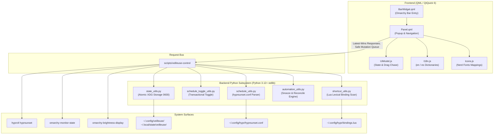

# Veilleuse

Native brightness, night light temperature, and day/night automation for Omarchy Quattro.

[](https://github.com/ZnOw01/Veilleuse/actions/workflows/checks.yml)
[](CHANGELOG.md)
[](LICENSE)

[Features](#features) ·
[Screenshots](#screenshots) ·
[Architecture](#architecture) ·
[Quick Start](#quick-start) ·
[Panel & Navigation](#panel--navigation) ·
[CLI Reference](#cli-reference) ·
[Storage and Security](#storage-and-security) ·
[Localization](#localization) ·
[Troubleshooting](#troubleshooting) ·
[Development](#development) ·
[Documentation](#documentation)

## Features

| Feature | Description |
| :--- | :--- |
| **Display Brightness** | 1–100% brightness control for the focused or a named external monitor via `omarchy-brightness-display`. |
| **Night Light & Gamma** | Temperature adjustment (`2500–6500 K`) and gamma correction (`0–100%`) via `hyprsunset`. |
| **Day/Night Automation** | Circadian schedule with per-period brightness, temperature, and gamma profiles. |
| **Timed Snooze** | Temporary night light suspension (1 minute to 24 hours) with automatic state reconciliation. |
| **Hybrid Navigation** | Arrow-key navigation (`← → ↑ ↓`) with real-time mouse-hover cursor tracking. |
| **Safe Hyprland Shortcuts** | Conflict-checked, reversible shortcut management in `~/.config/hypr/bindings.lua` with a `.bak` backup. |
| **Zero External Deps** | Python 3.12+ standard library only; no pip dependencies and no persistent daemons. |
| **Dual Localization** | English and Spanish dictionaries with tested key parity and localized backend errors. |
| **Atomic Persistence** | Mode `0600` XDG storage protected by `fcntl` file locks and atomic file replacement. |

## Screenshots

| Home | Automation | Settings |
| :---: | :---: | :---: |
|  |  |  |
| Night-light toggle, live brightness, temperature and gamma sliders, monitor picker | Day/night schedule editor with per-period display values and timed snooze | Language selector and conflict-checked global shortcut binding |

## Architecture


```mermaid
graph TD
    subgraph UI ["Frontend (QML / QtQuick 6)"]
        BW["BarWidget.qml<br/>(Omarchy Bar Entry)"] --> P["Panel.qml<br/>(Popup & Navigation)"]
        P --> UM["UiModel.js<br/>(State & Drag Chase)"]
        P --> I18N["I18n.js<br/>(en / es Dictionaries)"]
        P --> IC["Icons.js<br/>(Nerd Fonts Mappings)"]
    end

    subgraph IPC ["Request Bus"]
        P -->|"Latest-Wins Responses; Safe Mutation Queue"| VC["scripts/veilleuse-control"]
    end

    subgraph Backend ["Backend Python Subsystem (Python 3.12+ stdlib)"]
        VC --> SU["schedule_utils.py<br/>(hyprsunset.conf Parser)"]
        VC --> STU["schedule_toggle_utils.py<br/>(Transactional Toggle)"]
        VC --> SCU["shortcut_utils.py<br/>(Lua Lexical Binding Scan)"]
        VC --> AU["automation_utils.py<br/>(Snooze & Reconcile Engine)"]
        VC --> ST["state_utils.py<br/>(Atomic XDG Storage 0600)"]
    end

    subgraph System ["System Surfaces"]
        VC --> HS["hyprctl hyprsunset"]
        VC --> MS["omarchy-monitor-state"]
        VC --> BD["omarchy-brightness-display"]
        ST --> XDG["~/.config/veilleuse/<br/>~/.local/state/veilleuse/"]
        SU --> HCONF["~/.config/hypr/hyprsunset.conf"]
        SCU --> LUA["~/.config/hypr/bindings.lua"]
    end
```

### Backend Modules

| Module | Responsibility |
| :--- | :--- |
| `scripts/veilleuse-control` | Main CLI entry point, preflight diagnostics, bounded subprocesses, and response handling for the request bus. |
| `scripts/schedule_utils.py` | Comment-preserving parser for `hyprsunset.conf` with circular modulo-1440 time math. |
| `scripts/schedule_toggle_utils.py` | Transactional profile stripper and restorer for schedule enable/disable with SHA-256 state locking. |
| `scripts/shortcut_utils.py` | Lexically scans `bindings.lua`, checks key collisions, and edits only the Veilleuse marker block. |
| `scripts/automation_utils.py` | Dependency-injected orchestration engine for snooze countdowns, transition ramps, and drift reconciliation. |
| `scripts/state_utils.py` | Atomic XDG JSON persistence layer for `config.json`, `state.json`, and `history.jsonl` (mode `0600`, `fcntl` locks). |

See [PROJECT.md](PROJECT.md) for the component map and the contracts every change must preserve.

## Quick Start

### Requirements

- **Omarchy Quattro** (Omarchy 4.0+)
- **Hyprland** with `hyprsunset` installed
- **Python 3.12+** (`python3`, standard library only)

### Installation

```bash
# Install and enable plugin
omarchy plugin add https://github.com/ZnOw01/Veilleuse.git --enable --yes

# Update plugin and reload shell UI components
omarchy plugin update io.github.znow01.veilleuse --yes
omarchy restart shell

# Remove plugin (preserves hyprsunset.conf schedule and backups)
omarchy plugin remove io.github.znow01.veilleuse --yes
```

## Panel & Navigation

The popout panel provides three views:

- **Home (`home`)** — Master night-light toggle, brightness, temperature and gamma sliders, and monitor selector.
- **Automation (`automation`)** — Schedule toggle, start/end transition editors with per-period display presets, and timed snooze.
- **Settings (`settings`)** — Language selector (`English` / `Español`) and optional Hyprland global shortcut binding.

### Keyboard and Mouse Controls

| Input | Scope | Action |
| :--- | :--- | :--- |
| `↑` / `↓` | Everywhere | Move focus cursor vertically between rows |
| `←` / `→` | On sliders | Step value (`brightness` ±1%, `temperature` ±50 K, `gamma` ±1%) |
| `←` / `→` | On navigation and rows | Switch between routes (`Home` ↔ `Automation` ↔ `Settings`) |
| `Enter` / `Space` | On controls | Activate button, toggle switch, or open dropdown picker |
| `Esc` | Everywhere | Unfocus editor / close dropdown, or dismiss the panel |
| Mouse hover | Any row | Moves the keyboard cursor to the hovered row for instant `←` / `→` adjustment |

## CLI Reference

`scripts/veilleuse-control` is a synchronous helper: every command prints a JSON payload on stdout and exits non-zero on failure. Most read and write commands accept `--monitor`, which defaults to `focused` and otherwise takes an enabled monitor name (`status`, `brightness`, `nightlight`, `snooze`, `reconcile`, and every `schedule` subcommand except `schedule get`).

### Diagnostics

```bash
# Read combined system and plugin state as JSON
./scripts/veilleuse-control status
./scripts/veilleuse-control status --monitor DP-1

# Read-only availability check for the helper and its backends
./scripts/veilleuse-control preflight
```

### Display Brightness

```bash
# Read current brightness on the focused monitor
./scripts/veilleuse-control brightness

# Set brightness (1-100%) on the focused or a named monitor
./scripts/veilleuse-control brightness 75
./scripts/veilleuse-control brightness 75 --monitor DP-1
```

### Night Light and Gamma

```bash
# Toggle night light on/off
./scripts/veilleuse-control nightlight toggle

# Restore daylight natural color (identity)
./scripts/veilleuse-control nightlight natural

# Set custom temperature and gamma
./scripts/veilleuse-control nightlight temperature 3500
./scripts/veilleuse-control nightlight gamma 85
```

Temperature range: `2500–6500 K`. Gamma range: `0–100%`.

### Automation and Snooze

```bash
# Snooze night light for a set duration
./scripts/veilleuse-control snooze set --minutes 30
./scripts/veilleuse-control snooze set --seconds 1800
./scripts/veilleuse-control snooze clear
./scripts/veilleuse-control snooze status

# Read or modify the schedule
./scripts/veilleuse-control schedule get
./scripts/veilleuse-control schedule status
./scripts/veilleuse-control schedule enable
./scripts/veilleuse-control schedule disable
./scripts/veilleuse-control schedule set \
  --day-time 06:00 --night-time 18:30 \
  --day-temp 6200 --night-temp 3500 \
  --day-brightness 80 --day-gamma 100 \
  --night-brightness 50 --night-gamma 80

# Reconcile snooze expiration and schedule boundaries
./scripts/veilleuse-control reconcile
```

`--minutes` accepts `1–1440`; `--seconds` accepts `10–86400`. Schedule times use 24-hour `HH:MM`; day temperatures accept `5900–6500 K` (at or above `6000 K` the day profile is written as natural color), night temperatures accept `2500–5000 K`, and the optional per-period `--*-brightness` (1–100) and `--*-gamma` (0–100) values are validated on save.

### Global Shortcut Management

Veilleuse does not install a shortcut automatically.

```bash
# Install, inspect, or remove Hyprland shortcut binding
./scripts/veilleuse-control shortcut status
./scripts/veilleuse-control shortcut install --keys "SUPER, V"
./scripts/veilleuse-control shortcut remove
```

Installation validates keys against an allowlist, checks for collisions, and manages only the Veilleuse marker block in `~/.config/hypr/bindings.lua`:

```lua
-- >>> Veilleuse shortcut >>>
o.bind("SUPER + V", "Veilleuse", "omarchy-shell -q io.github.znow01.veilleuse toggleNightlight")
-- <<< Veilleuse shortcut <<<
```

A `bindings.lua.bak` backup is created before the first modification.

### Shell IPC

```bash
# Toggle night light directly through Omarchy Shell IPC
omarchy shell io.github.znow01.veilleuse toggleNightlight

# Toggle the popout panel UI
omarchy shell io.github.znow01.veilleuse toggle
```

## Storage and Security

| File Path | Purpose | Permissions | Safety Mechanism |
| :--- | :--- | :--- | :--- |
| `~/.config/hypr/hyprsunset.conf` | Night light temperature and schedule | Preserves the existing mode; a newly generated file uses `0600` | Atomic write under a shared lock; `.bak` when updating an existing file |
| `~/.config/hypr/.hyprsunset.conf.veilleuse-toggle.pending` | Recovery record for an interrupted schedule enable/disable | `0600` | Written before changing the schedule; resolved under the shared lock on the next schedule operation |
| `~/.config/hypr/bindings.lua` | Optional Hyprland shortcut | Preserves the existing mode; a newly created file uses `0644` | Collision checks and marker-block ownership; one-time `.bak` before install/update |
| `~/.config/veilleuse/config.json` | Plugin settings and language preference | `0600` | Atomic replace, versioned schema, stripped legacy keys |
| `~/.local/state/veilleuse/state.json` | Runtime state, snooze tokens, display values | `0600` | Atomic write, bounded validation |
| `~/.local/state/veilleuse/history.jsonl` | Audit history of operations | `0600` | Ring buffer capped at the last 50 entries |

Paths follow `XDG_CONFIG_HOME` and `XDG_STATE_HOME` when those variables are set.

### Core Invariants

1. **Non-destructive parsing** — Custom profiles, comments, and unmanaged blocks in `hyprsunset.conf` are preserved during schedule updates.
2. **Request ordering** — Only the current request ID is accepted as the current response. A stale successful readback may still be merged to reflect a write that completed; a running non-supersedable mutation is allowed to finish before the latest queued request launches.
3. **Fail-closed normalization** — Backend command failures or timeouts fall back to an explicit safe state with translated error messages.
4. **Zero daemon policy** — Periodic reconciliation and snooze checks run synchronously on state changes and shell lifecycle events without spawning daemons.

## Localization

Localization is decoupled from the UI framework in pure JavaScript (`I18n.js`):

- **Strict key parity** — English and Spanish dictionaries are checked for matching keys by automated tests.
- **Backend error mapping** — Known backend error codes map to localized messages; unknown diagnostics retain a safe fallback.
- **Fail-safe fallbacks** — Unknown locales select English (`en`). Missing translations fall back from the requested dictionary to English, then Spanish, then the raw key; unrecognized diagnostics pass through untouched.

## Troubleshooting

### Arrow keys switch views instead of moving the slider

The `←` / `→` keys adjust the slider that currently holds cursor focus. Hover the pointer over the slider row to focus it immediately, or press `↑` / `↓` until the row is highlighted.

### Updates do not appear after running `omarchy plugin update`

Reload the shell to unload cached QML components from memory:

```bash
omarchy restart shell
```

### Panel values display `—` or helper unavailable

Verify that `hyprsunset` is running and your focused display is detected:

```bash
./scripts/veilleuse-control status
./scripts/veilleuse-control preflight
```

### Global shortcut does not trigger

Inspect the shortcut status and check for conflicting key bindings:

```bash
./scripts/veilleuse-control shortcut status
```

## Development

The automated suite covers the Python backend and the JavaScript model/contracts. It does not launch Quickshell or simulate real desktop input, so it is not an end-to-end UI suite.

### Verification

```bash
# Run the Python and Node suites, hygiene checks, and available host validators
./scripts/check.sh

# Run the package hygiene gate (manifest validation, bytecode and symlink blockers)
./scripts/check_hygiene.sh
```

### Individual Test Runners

```bash
# Python backend unit tests
PYTHONDONTWRITEBYTECODE=1 python3 -m unittest discover -s tests -p 'test_*.py'

# Node.js model, contract, localization, transition, and navigation suites
node --test tests/UiModel.test.js tests/layout.test.mjs tests/i18n.test.js tests/errorCodes.test.js tests/icons.test.mjs tests/transitions.test.mjs tests/navigation_stress.test.mjs
```

Running the suites requires Node.js (CI uses Node 24) alongside Python 3.12+.

`check.sh` reports `SKIP` when `omarchy-plugin-validate` or the Omarchy QML imports needed by `qmllint` are unavailable. A successful run only proves those validations ran when the output confirms they were available. See [CONTRIBUTING.md](CONTRIBUTING.md) for pull request and Omarchy verification guidance, and [TEST_INFRA.md](TEST_INFRA.md) for the precise automated test scope.

## Documentation

| Document | Contents |
| :--- | :--- |
| [PROJECT.md](PROJECT.md) | Component map and architectural contracts |
| [CONTRIBUTING.md](CONTRIBUTING.md) | Environment, verification gates, and review expectations |
| [TEST_INFRA.md](TEST_INFRA.md) | Test coverage, limits, and host-dependent validators |
| [CHANGELOG.md](CHANGELOG.md) | Release history |

## Contributing

Open a pull request after `./scripts/check.sh` and `./scripts/check_hygiene.sh` pass and the diff is reviewed. Full expectations are listed in [CONTRIBUTING.md](CONTRIBUTING.md).

## License

MIT © 2026 [ZnOw01](https://github.com/ZnOw01). Released under the [MIT License](LICENSE).
